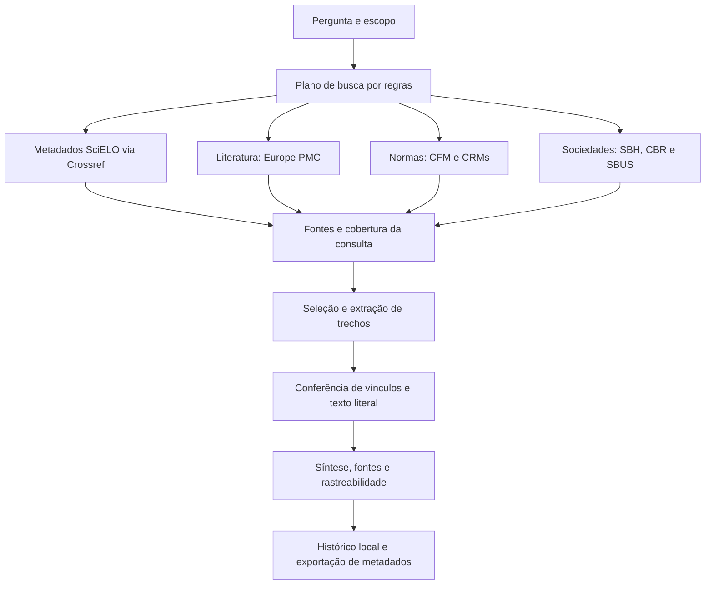

<p align="center">
  
</p>

# XPesquisa

**Uma plataforma em desenvolvimento para pesquisar literatura científica, localizar normas profissionais e consultar publicações de sociedades médicas, mantendo cada achado ligado à sua fonte.**

Criada pela **Xdiag Tecnologias**, no Brasil, para apoiar pesquisa, educação e atualização de profissionais de saúde. **XPesquisa é um nome provisório.** O projeto busca facilitar a investigação e a leitura crítica; não oferece diagnóstico autônomo, recomendação terapêutica validada ou parecer jurídico.

| Situação | Informação |
|---|---|
| Versão | **0.3.0 — protótipo funcional para uso local** |
| Repositório | **Público**, aberto para consulta e propostas de contribuição |
| Licença do código | Apache-2.0 |
| Interface | Navegador, em português do Brasil |
| Modo padrão | Síntese extrativa, sem exigir modelo de IA ou API paga |
| Fontes integradas | Europe PMC, base de normas CFM/CRMs, sites SBH, CBR e SBUS; metadados SciELO via Crossref |
| Validação registrada | 62 testes passaram; consultas reais documentadas em 23/09/2026 |

**Primeira visita:** [proposta](#por-que-o-projeto-existe) · [funcionalidades](#o-que-já-funciona) · [fontes](#fontes-e-cobertura-brasileira) · [limitações](#o-que-ainda-não-faz) · [instalação](#instalação-e-primeiro-acesso) · [colaboração](#como-colaborar).

## Por que o projeto existe

Uma pergunta em saúde pode exigir mais de uma classe de fonte. Artigos ajudam a investigar resultados científicos; conselhos profissionais publicam normas e pareceres; sociedades médicas divulgam documentos e atividades; bases brasileiras podem trazer material relevante para o contexto nacional. Pesquisar somente uma base pode deixar partes importantes da pergunta sem resposta.

Também não basta produzir um texto fluente com uma lista de referências. É necessário saber **qual consulta foi feita, quais fontes responderam, qual trecho foi recuperado e o que ainda não foi verificado**. O XPesquisa está sendo construído em torno dessa rastreabilidade.

A proposta é reunir pesquisa, organização de achados e revisão humana em um caderno de evidências. A versão atual entrega a base desse fluxo. Avaliação metodológica, comparação de discordâncias e interpretação clínica estruturada são etapas futuras, não capacidades já prontas.

## Para quem é

- **Profissionais de saúde:** explorar um assunto e localizar documentos para leitura, com atenção ao contexto brasileiro.
- **Pesquisadores e estudantes:** acompanhar consultas, fontes e trechos em um histórico inspecionável.
- **Especialistas e revisores:** avaliar a pertinência dos resultados e apontar lacunas ou interpretações inadequadas.
- **Desenvolvedores e instituições colaboradoras:** ampliar conectores, melhorar o método e testar a confiabilidade.

O uso atual é exploratório e local. Não foi validado para tomar decisões clínicas, emitir laudos ou orientar condutas individuais. Não insira dados identificáveis de pacientes.

## GitHub, aplicativo e colaboração

**Este repositório no GitHub** guarda código, documentação, histórico de mudanças e propostas de contribuição. É a página de apresentação e o espaço de desenvolvimento do projeto.

**O aplicativo XPesquisa** é instalado em um computador e aberto pelo navegador desse computador. O navegador apresenta a interface; o serviço Python consulta fontes externas e grava o histórico em um banco local. Novas buscas requerem internet; o histórico permanece local.

**Visitar o GitHub não executa o aplicativo.** Enviar o código também não cria um serviço público na internet. Hospedagem compartilhada, autenticação multiusuário e operação de produção ainda precisam ser desenvolvidas.

O projeto é open source, com repositório público e código sob Apache-2.0. Qualquer pessoa pode consultar o código, criar um fork e propor contribuições. A integração de mudanças e a concessão de acesso de escrita permanecem sob responsabilidade dos mantenedores da Xdiag.

## O que já funciona

| Capacidade | Comportamento atual |
|---|---|
| Pergunta em linguagem natural | Aplica regras iniciais para selecionar fontes e termos de busca |
| Escopo e estado | Permite escolher escopo e uma UF para consultas normativas |
| Pesquisa científica | Consulta Europe PMC; o exemplo hepático utiliza o recorte MED |
| Pesquisa normativa | Consulta resoluções e pareceres na base pública CFM/CRMs |
| Sociedades médicas | Consulta publicações públicas da SBH, do CBR e da SBUS nos assuntos contemplados |
| Cobertura transparente | Exibe consultas, resultados vazios, falhas, bloqueios e integrações pendentes |
| Síntese extrativa | Seleciona trechos literais e os apresenta vinculados às fontes |
| Rastreabilidade | Relaciona afirmação, evidência e fonte; registra consultas, datas, IDs e hashes |
| Histórico | Preserva pesquisas em SQLite e permite reabrir resultados |
| Navegação | Abas de síntese, fontes e rastreabilidade, com filtros documentais |
| Exportação | Gera JSON de metadados e vínculos, sem redistribuir os textos recuperados |
| IA local opcional | Adapter Ollama para rascunhos; o modo padrão não depende dele |

Falhar em uma fonte não apaga resultados das outras. Uma consulta vazia é diferente de uma consulta que não pôde ser concluída. Pesquisas antigas preservam sua execução original e podem ser refeitas com as fontes atuais.

## Como uma pesquisa acontece



Nem toda pergunta consulta todas as fontes. O planejamento usa regras e vocabulário limitado, não compreensão universal. Alguns temas têm consultas controladas; outros ainda usam a pergunta literal. O escopo e a consulta podem ser ajustados pelos controles disponíveis.

### Exemplo científico

**“Qual é a evidência atual sobre elastografia hepática para avaliação de fibrose?”**

No modo automático, a pergunta pode consultar Europe PMC e publicações da SBH/CBR. Resultados científicos e institucionais ficam identificados separadamente. Anúncios de cursos ou notícias sobre diretrizes não se transformam automaticamente em estudos ou diretrizes.

### Exemplo de medidas em ultrassom

**“Quero investigar medidas chave em ultrassom de punho”**

A versão 0.3 separa modalidade, anatomia e medidas, usando sinônimos em inglês na busca científica e termos curtos nos sites das sociedades. Também contempla ombro, joelho, tornozelo e cotovelo. Não infere uma doença nem fornece valores normais validados. O modo automático inclui a descoberta de metadados SciELO via Crossref e mostra as lacunas brasileiras, mesmo sem a palavra Brasil na pergunta.

### Exemplo normativo

**“Como as normas brasileiras tratam o uso de inteligência artificial na medicina?”**

O planejamento direciona a pesquisa para CFM/CRMs. Recupera ementas e metadados, exibindo a situação informada pela base. Selecionar uma UF mantém a consulta nacional e acrescenta a estadual. A interface mostra que legislação federal ainda não foi consultada automaticamente.

Isso ajuda a localizar documentos para leitura. **Não constitui resposta jurídica completa:** a íntegra, a vigência independente e outras normas aplicáveis precisam ser verificadas.

## Fontes e cobertura brasileira

| Fonte | Estado | Conteúdo e limites |
|---|---|---|
| Europe PMC | Integrada | Metadados e abstracts disponíveis; sem leitura geral do texto integral e sem conector NCBI direto |
| CFM/CRMs | Integrada | Ementa, número, ano, jurisdição e situação declarada de resoluções/pareceres; não lê a íntegra |
| Sociedade Brasileira de Hepatologia — SBH | Integrada | Posts e páginas públicos; podem incluir notícias, eventos e anúncios |
| Colégio Brasileiro de Radiologia — CBR | Integrada | Posts e páginas públicos; documentos e consultas podem apresentar falhas externas |
| SBUS — Sociedade Brasileira de Ultrassonografia | Integrada | Publicações públicas sobre ultrassonografia; páginas sem texto permanecem apenas como referências |
| Crossref — depositante FapUNIFESP/SciELO | Integrada, indireta | Examina até 20 candidatos do depositante 530; seleção lexical nos metadados. Não equivale a busca direta SciELO nem cobre toda a coleção |
| BVS/LILACS | Pendente | API oficial exige chave; portal restringe acesso automatizado neste ambiente. Link manual disponível |
| SciELO — busca direta | Pendente | Portal bloqueou acesso automatizado neste ambiente; a consulta Crossref é distinta e parcial |
| Legislação federal / Diário Oficial | Pendente | Complementação manual; normas profissionais não equivalem a cobertura de leis federais |
| Outras sociedades médicas | Pendente | Exigem ampliação do catálogo, do planejamento e dos conectores |

A consulta é exploratória, limitada à primeira página. O limite configurável chega a 20 documentos científicos/normativos por consulta; sociedades têm limite de até 5 publicações por fonte. CFM nacional e estadual são consultas separadas. Esses limites não permitem declarar uma busca exaustiva.

**E se o site não tiver uma caixa de busca?** Pode existir API pública ou outro acesso permitido. A implementação atual usa a busca pública CFM e APIs WordPress das três sociedades. Ainda não existe motor geral que descubra e pesquise qualquer site. Não há contratação de busca paga nem contorno de bloqueios, login ou paywalls.

Origem institucional brasileira não comprova população brasileira em um estudo. Ausência de resultados não comprova ausência de evidência ou norma. Consulte [fontes brasileiras: acesso e limites](docs/research/brazil-sources.md).

## O que significa rastreabilidade

| Elemento | Significado |
|---|---|
| **Fonte — Source** | Documento recuperado, com identificação, endereço e metadados disponíveis |
| **Evidência — Evidence** | Trecho da fonte, com localização no texto normalizado e vínculo ao documento |
| **Afirmação — Claim** | Achado apresentado ao leitor, ligado aos trechos utilizados |

A conferência verifica referências internas, correspondência literal dos trechos e integridade dos registros. Referências do Europe PMC também podem ter ID, título e DOI reconferidos **na mesma base**. Hashes identificam o conteúdo registrado; não atestam sua veracidade.

**Trecho conferido não significa interpretação validada.** Essas verificações não demonstram que uma inferência esteja correta, que um estudo tenha baixo risco de viés ou que seus resultados se apliquem a um paciente. DOI não é resolvido independentemente. Documentos institucionais e registros Crossref não recebem validação independente de conteúdo. DOI repetido entre fontes não gera afirmações extrativas duplicadas.

## O que ainda não faz

- Revisão sistemática completa, paginação exaustiva ou seleção clínica automatizada confiável.
- Avaliação GRADE, risco de viés ou ranking metodológico validado.
- Extração geral de população, amostra, intervenção e desfechos, ou determinação do país da população.
- Verificação de retratações, busca ativa de evidência contrária ou adjudicação de discordâncias.
- PICO/PECO geral ou tradução automática no modo extrativo.
- Leitura automática de PDFs ou íntegra das normas; links relacionados podem servir apenas para abertura manual.
- Cobertura de todas as bases brasileiras, de todos os CRMs fora da base consultada ou de todas as sociedades.
- Serviço público com contas de usuário, controle de acesso e infraestrutura de produção.

Resultados podem incluir cartas, estudos animais, notícias e materiais pouco pertinentes. A filtragem lexical inicial de textos institucionais reduz alguns falsos achados, mas não substitui avaliação humana de relevância. As limitações aparecem também no resultado da pesquisa.

## Instalação e primeiro acesso

Requisitos: **Python 3.10 ou superior**, Git. O repositório é público e pode ser clonado sem convite. Node, conta em fornecedor de IA e API paga não são necessários para executar o aplicativo. Novas consultas requerem internet.

### Windows — PowerShell

```powershell
git clone https://github.com/Xdiag-IA/xpesquisa.git
cd xpesquisa
python -m venv .venv
.venv\Scripts\python -m pip install -c requirements.lock -e ".[dev]"
.venv\Scripts\python -m xpesquisa.cli serve
```

Os comandos usam diretamente o ambiente virtual, sem exigir alteração da política de ativação do PowerShell.

### macOS / Linux

```sh
git clone https://github.com/Xdiag-IA/xpesquisa.git
cd xpesquisa
python3 -m venv .venv
.venv/bin/python -m pip install -c requirements.lock -e '.[dev]'
.venv/bin/python -m xpesquisa.cli serve
```

Abra **http://127.0.0.1:8765** no mesmo computador. Use uma pergunta de exemplo, confira o escopo e clique em **Pesquisar fontes**. Acompanhe a cobertura e explore **Síntese e achados**, **Fontes** e **Rastreabilidade**.

Se a porta estiver ocupada, acrescente `--port 8788` ao comando e abra a porta escolhida. `127.0.0.1` significa o próprio computador de quem abre o link; não é demonstração pública hospedada pela Xdiag.

Detalhes da instalação de desenvolvimento, incluindo a prévia em 8788 e seu banco separado, estão no [estado do projeto](docs/STATUS.md). A porta padrão de novas instalações continua 8765.

### Configuração

Defina as variáveis no ambiente do processo. [.env.example](.env.example) é referência: **não é carregado automaticamente**.

| Variável | Uso |
|---|---|
| `XPESQUISA_DATA_DIR` | Diretório do banco; padrão `./data` |
| `XPESQUISA_PROVIDER` | `extractive` por padrão; `ollama` para experimentar modelo local |
| `XPESQUISA_MODEL` | Nome de modelo já instalado no Ollama |
| `XPESQUISA_OLLAMA_URL` | Endereço local; padrão `http://127.0.0.1:11434` |
| `XPESQUISA_API_KEY` | Reservada; não utilizada neste MVP |

### IA local opcional

O padrão não chama LLM. Apresenta trechos no idioma da fonte e explicações de interface em português. Um modelo **já instalado** no Ollama pode produzir rascunhos:

```powershell
$env:XPESQUISA_PROVIDER="ollama"
$env:XPESQUISA_MODEL="nome-do-seu-modelo-local"
.venv\Scripts\python -m xpesquisa.cli serve
```

No macOS/Linux, use `export XPESQUISA_PROVIDER=ollama` e `export XPESQUISA_MODEL=nome-do-seu-modelo-local`. O adapter aceita apenas loopback; XPesquisa não baixa modelos. Falhas de resposta ou citações inválidas acionam retorno ao modo extrativo, registrado no histórico. O adapter foi testado com mocks; modelo real ainda não foi validado neste marco.

### Docker

```sh
docker compose up --build
```

Publica somente na interface local, porta 8765, com volume persistente. Para mudar a porta, ajuste o lado esquerdo do mapeamento no Compose. O arquivo foi verificado sintaticamente, mas a imagem não foi validada porque o engine estava indisponível. O MVP não possui autenticação para exposição pública.

## Dados, privacidade e exportação

O banco padrão é `data/xpesquisa.db`, excluído do Git. Perguntas, resultados e registros permanecem no histórico local. **Local não significa sem comunicação externa:** os termos de busca são enviados às fontes consultadas. Não use dados identificáveis de pacientes nas perguntas.

Use somente uma instância por banco. Para backup simples, pare o servidor e preserve a pasta de dados. Pesquisas interrompidas são marcadas como falhas no reinício, sem retomada automática. O histórico lista as 50 mais recentes; a API mantém acesso por ID às demais.

A exportação JSON inclui metadados, IDs, vínculos, consultas, timestamps e hashes. Omite textos recuperados, trechos, textos de afirmações e prompts com conteúdo científico. **As consultas permanecem na exportação:** revise-as antes de compartilhar. O arquivo não é formato de importação nem backup completo.

Apache-2.0 cobre o código, não os artigos ou documentos recuperados. Acesso público e permissão em robots não concedem automaticamente direito de republicação. Publicações e dependências mantêm seus próprios termos.

## Arquitetura e organização

Backend em **Python, FastAPI e Pydantic**, HTTPX para fontes e SQLite para persistência. Interface em HTML, CSS e JavaScript, sem build obrigatório e sem CDN. O núcleo é independente de fornecedores de IA e de produtos clínicos da Xdiag.

```text
src/xpesquisa/
  api.py           Serviço HTTP e endpoints
  cli.py           Inicialização local
  models.py        Contratos de pesquisa, fonte, evidência e afirmação
  planning.py      Planejamento e escolha das fontes
  connectors.py    Conector científico e normalização de texto
  brazil.py        Acesso a normas e sociedades brasileiras
  crossref.py      Descoberta indireta de depósitos SciELO no Crossref
  pipeline.py      Execução, seleção, conferências e síntese
  providers.py     Modo extrativo e adapter Ollama
  web/             Interface em português
tests/             Testes com dados sintéticos
docs/              Estado, validação, pesquisa e decisões arquiteturais
```

A documentação da API está em `/docs` no aplicativo em execução.

| Método e caminho | Finalidade |
|---|---|
| `GET /api/health` | Estado básico do serviço |
| `POST /api/research` | Iniciar pesquisa |
| `GET /api/research` | Histórico recente |
| `GET /api/research/{run_id}` | Pesquisa e registros |
| `GET /api/research/{run_id}/export` | Exportação de metadados |

## Validação e qualidade

Na validação registrada da versão 0.3, **62 testes passaram**. A suíte usa dados sintéticos e mocks, sem chamadas externas ou pagas. Inclui vínculos inválidos, trechos adulterados, falhas versus vazio, bloqueios, redirects, classificação documental e compatibilidade histórica.

Consultas reais foram feitas separadamente: a pesquisa normativa localizou documentos CFM/CRMs; a hepática recuperou artigos e publicações SBH. O CBR respondeu em teste isolado, mas apresentou falha HTTP em uma execução integrada, registrada sem apagar outros resultados.

Isso demonstra comportamento do software e rastreabilidade, **não eficácia clínica ou cobertura completa**. Detalhes e limites de Docker, Ollama e CI estão em [validação](docs/validation.md).

```powershell
.venv\Scripts\python -m pytest
```

No macOS/Linux, use `.venv/bin/python -m pytest`. As versões verificadas estão em `requirements.lock`; instalar com `-c` aplica essas restrições. O workflow CI é manual e a matriz remota ainda não foi validada.

## Próximas etapas

1. **Ampliar o Brasil:** viabilizar acesso oficial BVS/LILACS, busca direta SciELO e legislação federal; ampliar sociedades além de SBH/CBR/SBUS. A descoberta indireta via Crossref já funciona, mas não substitui essas integrações.
2. **Melhorar a busca:** vocabulário DeCS/MeSH, planejamento editável, paginação e critérios de seleção.
3. **Estruturar evidências:** população, amostra e desfechos, com trecho de suporte para cada campo.
4. **Aprofundar a verificação:** resolução independente de IDs e avaliação semântica com especialistas.
5. **Trabalhar discordâncias:** busca ativa de evidência contrária, comparação e revisão humana.
6. **Preparar colaboração ampliada:** avaliação de uso, segurança e operação antes de um serviço compartilhado.

Essa lista expressa direção, sem promessa de prazo. O [roadmap](docs/roadmap.md) descreve critérios para avançar sem apresentar recursos incompletos como prontos.

## Como colaborar

Profissionais de saúde podem trazer perguntas representativas, avaliar pertinência, indicar fontes e revisar achados. Desenvolvedores podem contribuir com conectores, testes, interface e documentação. Especialistas em informação científica podem ajudar com estratégias de busca e seleção.

O repositório é público. Para contribuir com código, crie um fork e envie uma proposta para revisão. **Issue** registra problema ou proposta; **pull request** apresenta alteração para revisão. Comece por uma contribuição delimitada, explique a motivação e registre como foi validada.

Leia [CONTRIBUTING.md](CONTRIBUTING.md), [Código de Conduta](CODE_OF_CONDUCT.md) e [Segurança](SECURITY.md). Não envie dados de pacientes, credenciais ou textos de terceiros sem autorização de uso. Mudanças arquiteturais exigem ADR. Acesso de escrita e integração de mudanças são decisões dos mantenedores.

## Guia da documentação

| Documento | O que encontrar |
|---|---|
| [Estado do projeto](docs/STATUS.md) | Marcos, ambiente local e problemas conhecidos |
| [Validação](docs/validation.md) | Testes, provas reais e o que não foi validado |
| [Roadmap](docs/roadmap.md) | Próximos incrementos e critérios de avanço |
| [Fontes brasileiras](docs/research/brazil-sources.md) | Métodos de acesso, limites e direitos |
| [Panorama de projetos](docs/research/landscape.md) | Referências estudadas e contexto |
| [Decisões arquiteturais](docs/adr/) | Justificativas das escolhas técnicas |
| [Contribuição](CONTRIBUTING.md) | Fluxo para propor e revisar mudanças |
| [Avisos de terceiros](THIRD_PARTY_NOTICES.md) | Dependências e atribuições |
| [Licença](LICENSE) e [marcas](TRADEMARKS.md) | Regras do código e uso de nomes e marcas |

---

**XPesquisa · Uma iniciativa Xdiag Tecnologias**

Pesquisa, educação e atualização científica com fontes visíveis e limites explícitos.

[Repositório oficial](https://github.com/Xdiag-IA/xpesquisa) · Documentação consolidada em 23 de setembro de 2026.
